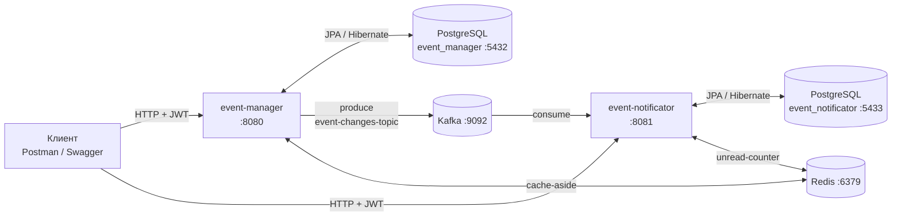

# Event Manager Platform

Учебный backend-проект в духе «Яндекс.Афиши»: сервис для управления мероприятиями, локациями и регистрациями + отдельный микросервис пользовательских уведомлений. Проект проходится итерациями — от монолитного CRUD-фундамента до распределённой системы с Kafka и Redis.

Главный принцип проекта: **сначала корректность, потом скорость**. PostgreSQL всегда остаётся источником истины, Redis — лишь ускоритель, который не должен ломать бизнес-операции.

## О проекте

Система моделирует реальную афишу: одни пользователи создают мероприятия и управляют ими, другие находят подходящие события, регистрируются, отменяют участие и следят за изменениями. Когда мероприятия меняются (время, место, статус, отмена), подписанные пользователи получают уведомления через отдельный сервис.

Проект deliberately усложняется постепенно: если рано прыгнуть в распределённость и оптимизации, потом придётся чинить не новую технологию, а неустойчивый фундамент. Поэтому сначала — слои, миграции, валидация и формат ошибок; затем безопасность; потом насыщенный домен; и только после — асинхронное взаимодействие и оптимизация горячих путей.

## Архитектура



Принципы:

- У каждого сервиса **своя база данных** — никакого общего schema-пространства.
- **Kafka** — асинхронная связь: event-manager публикует доменные события об изменениях, event-notificator строит из них пользовательский inbox.
- **Redis** — ускоритель: cache-aside для горячих чтений и быстрый счётчик непрочитанных. При недоступности Redis сервисы мягко деградируют к БД, а не падают.
- **Идемпотентность** уведомлений по `messageId` — повторная доставка Kafka-сообщения не создаёт дубликатов.

## Сервисы и модули

| Модуль | Ответственность |
|---|---|
| `event-manager` | Пользователи и JWT, локации, мероприятия, регистрации, поиск, публикация доменных событий в Kafka, scheduler статусов |
| `event-notificator` | Потребление Kafka-сообщений, хранение нотификаций, inbox API, unread-counter в Redis |
| `event-common` | Общий контракт Kafka-сообщений (`EventChangeKafkaMessage`, `ChangeItem`) и общие исключения |
| `infra/` | Compose-файлы для PostgreSQL, Kafka и Redis |
| `docs/openapi/` | OpenAPI-контракты обоих сервисов — источник правды по API |

## Стек технологий

| Слой            | Технология |
|-----------------|---|
| Язык            | Java 21 |
| Каркас          | Spring Boot, Spring MVC |
| Persistence     | Spring Data JPA, Hibernate, Liquibase |
| Безопасность    | Spring Security + JWT |
| База данных     | PostgreSQL |
| Messaging       | Apache Kafka |
| Кеш / счётчики  | Redis |
| Тестирование    | JUnit 5, Mockito, Spring Test, Testcontainers |
| Сборка          | Maven |
| Контракты       | OpenAPI / Swagger |
| Инфраструктура  | Docker Compose |
| Ручные проверки | Postman |

## Требования

- Java 21
- Maven 3.9+
- Docker с поддержкой Compose

## Инфраструктура

Поднять PostgreSQL, Kafka и Redis:

```bash
docker compose up -d
```

| Сервис | Порт |
|---|---|
| PostgreSQL event-manager | 5432 |
| PostgreSQL event-notificator | 5433 |
| Zookeeper | 2181 |
| Kafka | 9092 |
| Redis | 6379 |
| event-manager | 8080 |
| event-notificator | 8081 |

## Сборка и запуск

```bash
# сборка и тесты всего проекта
mvn clean verify

# запуск сервисов
mvn -pl event-manager spring-boot:run
mvn -pl event-notificator spring-boot:run

# тесты одного модуля
mvn -pl event-manager test
mvn -pl event-notificator test
```

## API

Полные контракты — в `docs/openapi/*.yaml`. Ниже — сводка.

### event-manager (:8080)

| Метод | Путь | Описание | Доступ |
|---|---|---|---|
| POST | `/users` | Регистрация (роль USER, уникальный логин) | без JWT |
| POST | `/users/auth` | Аутентификация, выдача JWT | без JWT |
| GET | `/users/{userId}` | Пользователь по ID | ADMIN |
| GET | `/locations` | Список локаций (пагинация) | ADMIN, USER |
| POST | `/locations` | Создать локацию | ADMIN |
| GET | `/locations/{locationId}` | Локация по ID | ADMIN, USER |
| PUT | `/locations/{locationId}` | Обновить локацию | ADMIN |
| DELETE | `/locations/{locationId}` | Удалить локацию (400, если есть мероприятия) | ADMIN |
| POST | `/events` | Создать мероприятие | USER |
| GET | `/events/{eventId}` | Карточка мероприятия | ADMIN, USER |
| PUT | `/events/{eventId}` | Обновить мероприятие (+ публикация в Kafka) | владелец / ADMIN |
| DELETE | `/events/{eventId}` | Отменить мероприятие (soft-delete → CANCELLED) | владелец / ADMIN |
| POST | `/events/search` | Поиск по фильтру (пагинация) | ADMIN, USER |
| GET | `/events/my` | Мероприятия текущего пользователя | USER |
| POST | `/events/registrations/{eventId}` | Записаться на мероприятие | USER |
| DELETE | `/events/registrations/cancel/{eventId}` | Отменить свою регистрацию | USER |
| GET | `/events/registrations/my` | Мои регистрации | USER |

### event-notificator (:8081)

| Метод | Путь | Описание | Доступ |
|---|---|---|---|
| GET | `/notifications` | Непрочитанные нотификации текущего пользователя | ADMIN, USER |
| POST | `/notifications` | Пометить нотификации прочитанными | ADMIN, USER |

JWT для event-notificator выдаётся event-manager-ом — сервисы делят один секрет токенов.

## Доменные правила

Жизненный цикл мероприятия:

```
WAIT_START ──(время старта / scheduler)──▶ STARTED ──(окончание / scheduler)──▶ FINISHED
     │
     └──(DELETE /events/{id})──▶ CANCELLED
```

- Регистрация — только на `WAIT_START` и только при свободных местах; `ADMIN` не участвует в мероприятиях как посетитель.
- Отмена регистрации недоступна после начала мероприятия.
- Отменить (`DELETE`) можно только ещё не начавшееся мероприятие; строка в БД не удаляется — статус меняется на `CANCELLED`.
- `maxPlaces` мероприятия не может превышать вместимость локации; вместимость локации нельзя уменьшить, если это ломает существующие мероприятия.
- Роли: `ADMIN` — сотрудник платформы, `USER` — организатор и участник.

## Кеширование и unread-counter

**event-manager (cache-aside):**

- Кешируются: список локаций, локация по id, карточка события по id.
- Инвалидация: после `POST/PUT/DELETE` локаций, `PUT/DELETE` событий и после смены статуса scheduler-ом.
- Деградация: ошибка Redis логируется и превращается в cache-miss — чтение уходит в PostgreSQL, запрос не падает.

**event-notificator (unread-counter):**

- Ключ на пользователя: `notif:unread:{userId}`.
- Создание unread-нотификаций → `INCRBY` (атомарно, на стороне Redis).
- После `POST /notifications` — фактическое количество непрочитанных пересчитывается из БД и пишется через `SET`.

## Тестирование
#### Интеграционное тестирование с Testcontainers
Проект использует Testcontainers для изолированного интеграционного тестирования без развёртывания внешней инфраструктуры:
- PostgreSQL — поднятие реальной базы данных в контейнере для тестирования репозиториев и транзакций
- Redis — контейнер для тестирования кеша и счётчиков непрочитанных уведомлений
- Kafka — контейнер для тестирования асинхронной отправки событий и уведомлений